# Keymap Generator for Call of Duty: Mobile (Gameloop)

---

This is a keymap generator for Call of Duty: Mobile designed for the Gameloop emulator. It includes some fixes and optimizations to improve the controls.

This is the source code  of [Gameloop CODM Keymap generator](https://napharcos.github.io/Gameloop-CODM-Keymap/).

## How to use guide

---

This guide will presents how to use the Gameloop CODM Keymap Generator.
The website includes some fixes and optimizations to improve the controls.
To start open the [website](https://napharcos.github.io/Gameloop-CODM-Keymap/).

### Change keys

Each item has a description that provides information about that button. - It is marked (1) in the image.

You can replace all buttons with your preferred one:
   - Click the button you want to replace. - It is marked (2) in the image.
   - Press the button you want to replace the button with.

> #### More Info
>
> With the `reset` button you can reset the button to its original state. - It is marked (3) in the image.
>
> The site does not allow duplication of buttons and does not allow download if any button is missing.


You can switch between mods by clicking the mod name. - As shown in the image.

So you can configure keymap for every mod.


The browser save your configuration so next time you need only download it.

### Download & import

Click the `DOWNLOAD` button to download keymap for the selected mod.


Now the file is saved to your computer usually in the download folder.

Now launch CODM and click the `Keybinding` menu element and select the game mod.

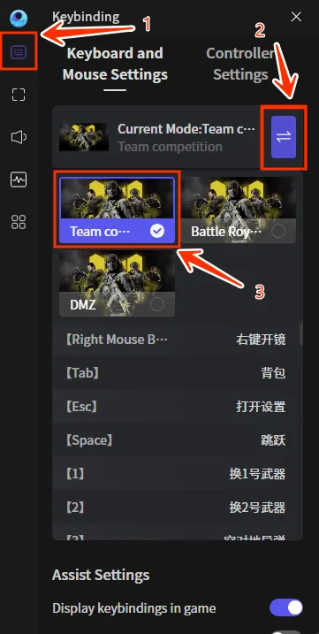

After game mod selected press import and select the downloaded text file. - Shown in the image.

> #### Important
>
> Every keymap works only its own type. So make sure select the correct mod before import.

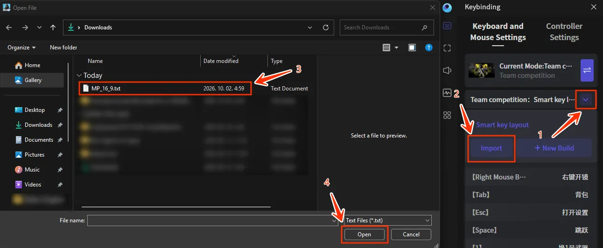

For last step select the imported keymap.

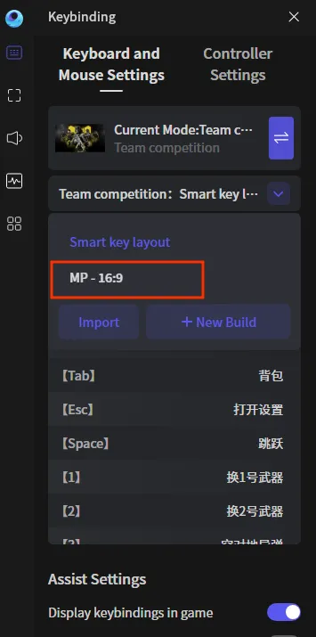

### Tip

The tip presents how to create desktop shortcut for CODM.

First copy this command:
   ``` Path 
   "C:\Program Files\Tencent\GameLoop\Application\GameLoopLauncher.exe" --launch-proc-name GameLoopEmulator.exe --launch-pkg-name com.activision.callofduty.shooter --from 8
   ```
Now go to desktop and create new shortcut:
   - Right click to the desktop and go to `new`.
   - Click the `shortcut` button. - It is marked on the image.

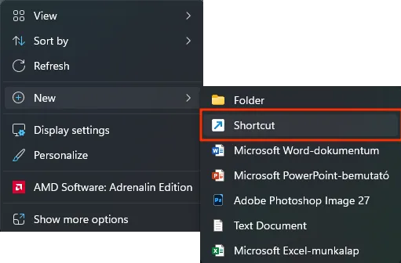

This will start the `create shortcut` wizard.

- Now paste the command to the textbox. - It is marked (1) in the image.
- And press next. - It is marked (2) in the image.

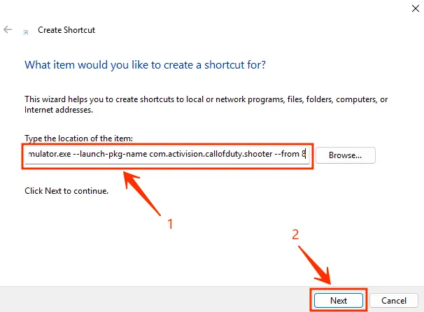

- Add a name for example `CODM`. - It is marked (1) in the image.
- Press finish. - It is marked (2) in the image.

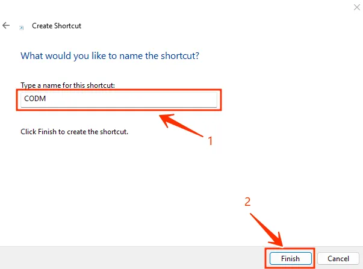

Now the shortcut completed, double click and CODM is launched.

### Tip2

First create desktop shortcut for `Settings` the steps are same as in [Tip](#Tip), but with another command.

So copy this command and create the shortcut:
   ``` Path 
   "C:\Program Files\Tencent\GameLoop\Application\GameLoopLauncher.exe" --launch-proc-name GameLoopEmulator.exe --launch-pkg-name com.android.settings --from 8
   ```
After shortcut created open it.

And go to:
- Apps → See all aps → Google Play services → first force stop then disable it

Steps:

| Apps | See all aps | Google Play services | Force stop | Disable |
| :---: | :---: | :---: | :---: | :---: |
| 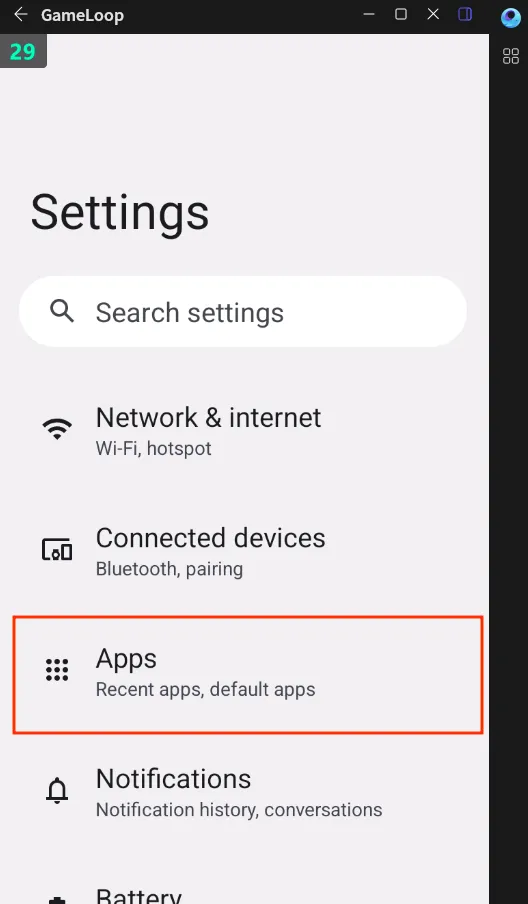 | 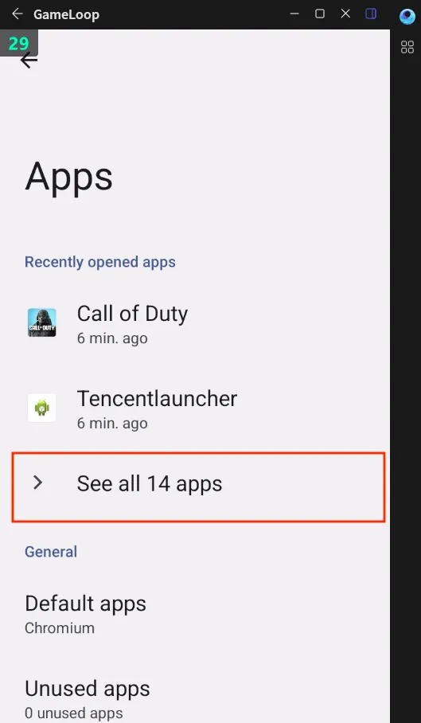 | 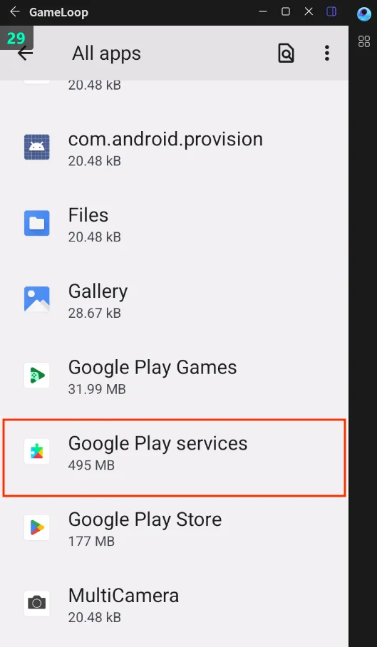 | 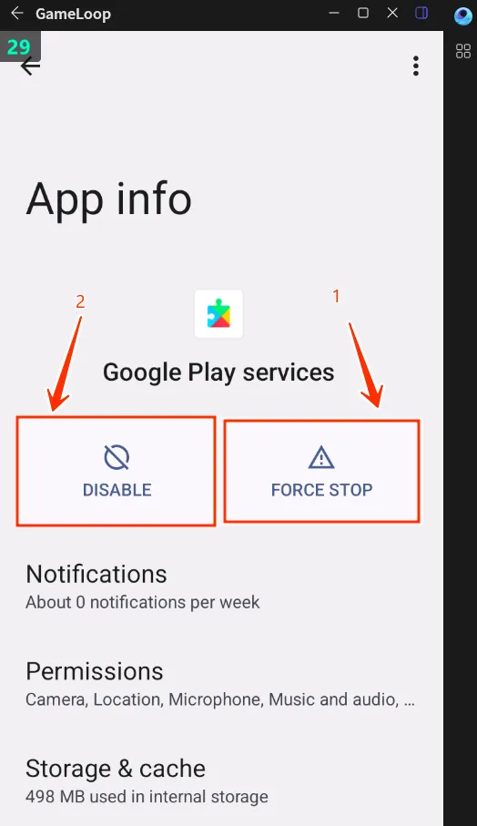 | 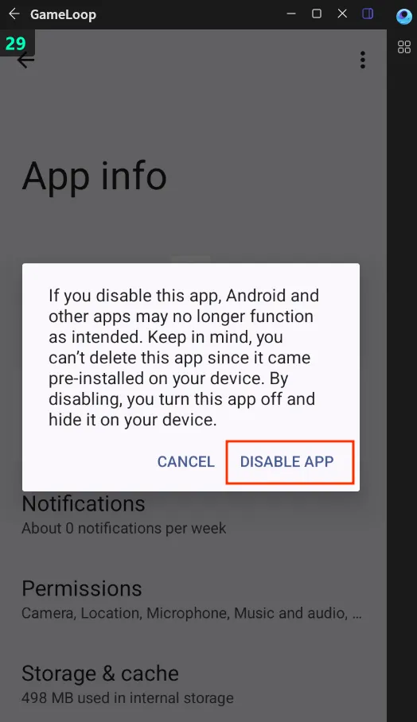 |